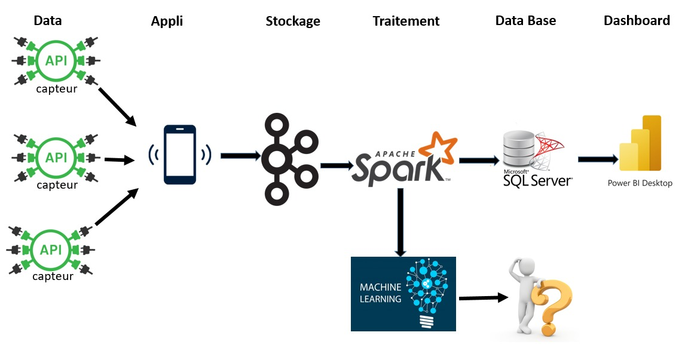

# BreatheSafe - Surveillance en Temps Réel de l'Air Ambiant

## Octobre 2023 - Décembre 2023

**Objectif :** Implémentation d'un système complet assurant une surveillance continue de divers paramètres liés à la pollution de l'air, tels que le CO2, le NO2, les particules fines, et d'autres polluants atmosphériques.

## Architecture du Projet

## Technologies Utilisées
- **Flask**: Framework web en Python pour la création d'une interface utilisateur conviviale.
- **Kafka**: Plateforme de diffusion de flux en temps réel pour la gestion et la transmission des données.
- **Python**: Langage de programmation utilisé pour le développement.
- **SQL Server Management Studio**: Gestion de base de données relationnelle pour le stockage robuste des données traitées.
- **Pyspark**: Bibliothèque Python pour le traitement des données en temps réel avec Apache Spark.
- **GitHub**: Plateforme de gestion de version pour le suivi des modifications et la collaboration.
- **Apache Airflow**: Plateforme pour orchestrer des workflows et automatiser les tâches.
- **Power BI**: Outil de visualisation de données pour créer des rapports interactifs.
- **Méthode Agile**: Méthodologie de développement itérative et collaborative pour une flexibilité accrue.

## Fonctionnalités Principales

### 1. Intégration de Capteurs Polluants
- Collecte en temps réel des données de qualité de l'air à l'aide de capteurs polluants.
- Stockage des données dans Kafka pour la gestion des flux en temps réel.

### 2. Jobs Spark Streaming
- Implémentation de jobs Spark Streaming pour le traitement en temps réel des flux de données provenant de Kafka.
- Insertion des données traitées dans une base de données Microsoft SQL Server.

### 3. Utilisation de Power BI
- Connexion à la base de données SQL Server à l'aide de Power BI.
- Création de tableaux de bord interactifs en temps réel pour la visualisation des données.

### 4. Implémentation des DAGs dans Apache Airflow
- Automatisation des flux de travail avec des Directed Acyclic Graphs (DAGs) dans Apache Airflow.
- Planification et exécution des tâches de manière automatisée.
