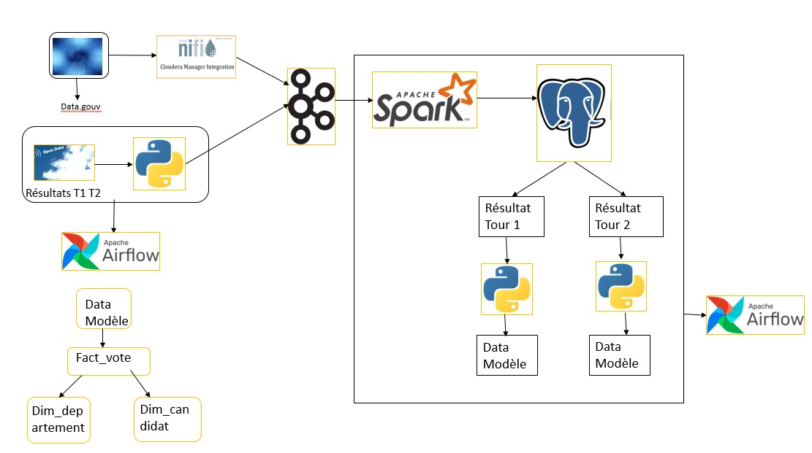
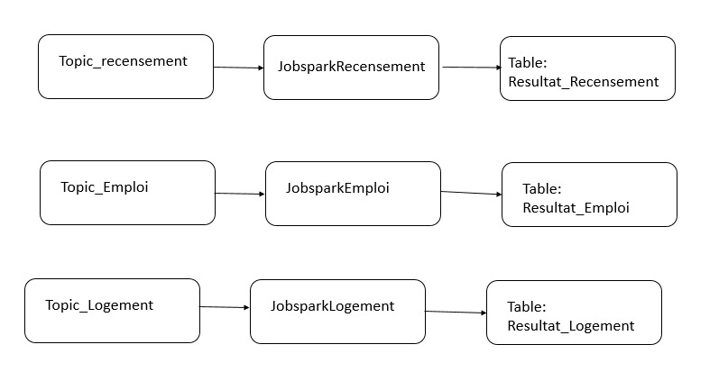
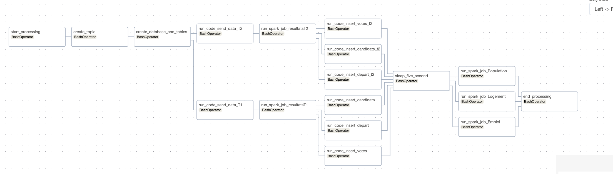

<div style="text-align:center">
    
</div>


# Projet d'Analyses des Élections Présidentielles en France - Data Pipeline

Dans le cadre de la réalisation des analyses sur les élections présidentielles en France d’avril 2022, nous avons choisi de mettre en place un data pipeline pour la réalisation de ce projet. Sur le site français des statistiques, nous avons trouvé des datasets pouvant nous aider à avoir des données telles que celles des résultats des 1ers et 2èmes tours, du recensement 2020 et de l’emploi. Ces données nous ont permis de mettre en place des pipelines de données de la collecte jusqu’à l’analyse.

## Technologies Utilisées

- Nifi
- Airflow
- Python
- Kafka
- Spark
- PostgreSQL

## Flux de Données

Apache Nifi nous a permis d’intégrer les données venant d'internet. Pour le développement des flux de données, les processeurs tels que `invokeHTTP` nous ont aidés à récupérer les sources de données sur data.gouv. Les sources de données ont été converties à l’aide du processor `UnpackContent` avant d’être envoyées vers le processeur `SplitText` qui nous a permis de traiter les données ligne par ligne. Enfin, le processeur `PublishKafka` a été utilisé pour stocker les données. Chaque flux correspond à une source de données.

Exemples de sources de données :
- [Base CC Évolution Structurelle de la Population 2020](https://www.insee.fr/fr/statistiques/fichier/7632446/base-cc-evol-struct-pop-2020_xlsx.zip)
- [Base CC Emploi Population Active 2020](https://www.insee.fr/fr/statistiques/fichier/7632867/base-cc-emploi-pop-active-2020_csv.zip)
- [Base CC Logement 2020](https://www.insee.fr/fr/statistiques/fichier/7631186/base-cc-logement-2020_csv.zip)

## Kafka

Nous avons utilisé Kafka pour stocker les données collectées. Les données sur les résultats des 1ers et 2èmes tours, de la Population, de l’Emploi et du Logement, sont envoyées dans Kafka. Une fois dans Kafka, elles sont récupérées et traitées par des jobs Spark. Les résultats sont ensuite déposés dans des tables.


## Apache Spark : Traitement des Données

Les données issues du recensement, de l'emploi et du logement sont traitées efficacement grâce à des jobs Spark. Ces jobs récupèrent les données présentes dans des topics distincts de notre broker local, les traitent de manière appropriée, puis les déposent dans des tables dédiées. Par exemple :

- Les données des élections du premier tour sont stockées dans le topic `Topic_Resultat_TourT1`. Elles sont traitées par notre job Spark appelé `JobSparkResultatT1.py` et ensuite stockées dans la table `resultat_tourT1`.

- **Topic :** `Topic_Resultat_TourT1`
  - **Description :** Données des élections du premier tour
  - **Traitement :** Job Spark appelé `JobSparkResultatT1.py`
  - **Destination :** Table `resultat_tourT1`

Les données telles que celles du recensement, de l’emploi et du logement sont traitées à l’aide de job Spark. 

### Flux de Traitement
<div style="text-align:center">
    
</div>


# Apache Airflow: DAG(Processing_data_spark)

<div style="margin: auto; text-align: center;">
    
</div>

## Description

Ce DAG (Directed Acyclic Graph) a été conçu pour orchestrer le traitement des données dans un environnement Apache Airflow, en utilisant des tâches dépendantes pour automatiser le flux de travail complet. Le DAG est conçu pour être exécuté quotidiennement, démarrant à la date spécifiée.

## Tâches Principales

1. **start_processing_task :**
   - *Description :* Point de départ du flux de travail.
   - *Action :* Affiche un message indiquant le début du traitement ETL (Extract, Transform, Load).

2. **create_topic_task :**
   - *Description :* Crée un sujet pour les élections en exécutant le script Bash create_Election_topics.sh.
   - *Action :* Prépare l'environnement pour le traitement ultérieur.

3. **create_database_tables_task :**
   - *Description :* Crée les tables de la base de données en exécutant le script Bash create_database_and_tables.sh.
   - *Action :* Prépare la base de données pour stocker les résultats du traitement.

4. **send_data_task_tour1 / send_data_task_tour2 :**
   - *Description :* Envoie des données à Kafka pour deux tours d'élections distincts.
   - *Action :* Prépare les données pour le traitement Spark.

5. **spark_task_emploi / spark_task_logement / spark_task_population :**
   - *Description :* Exécute des tâches Spark pour traiter les données liées à l'emploi, au logement et à la population.
   - *Action :* Effectue des calculs complexes et génère des résultats.

6. **spark_task_resultatsT1 / spark_task_resultatsT2 :**
   - *Description :* Exécute des tâches Spark spécifiques pour les résultats des deux tours d'élections.
   - *Action :* Génère des résultats spécifiques aux tours d'élections.

7. **insert_task_candidats / insert_task_departements / insert_task_fact_votes / insert_task_candidats_t2 / insert_task_departements_t2 / insert_task_fact_votes_t2 :**
   - *Description :* Insère des données dans le modèle de données pour les candidats, les départements et les votes, respectivement.
   - *Action :* Intègre les résultats Spark dans le modèle de données.

8. **end_processing_task :**
   - *Description :* Point d'arrivée du flux de travail.
   - *Action :* Affiche un message indiquant la fin du traitement.

9. **wait_five_second_task :**
   - *Description :* Pause de 5 secondes entre les tâches d'insertion et les tâches Spark.
   - *Action :* Assure une séquence appropriée dans le flux de travail.

## Dépendances
Les tâches sont organisées de manière à respecter les dépendances logiques, assurant l'exécution séquentielle des différentes étapes du traitement des données.

## Base de Données PostgreSQL

La base de données PostgreSQL joue un rôle crucial dans le stockage des données traitées. Grâce à ces données, nous avons élaboré deux modèles de données pour faciliter l'accès et l'analyse des informations.

### Data Models

Nous avons élaboré deux data models pour faciliter l'accès aux données et simplifier le processus d'analyse. Ces modèles, organisés de manière structurée, permettent une navigation aisée à travers les résultats du 1er tour et du 2ème tour des élections présidentielles. Chaque modèle est conçu pour offrir une vue précise et ciblée des données, facilitant ainsi les différentes analyses que nous entreprenons.

Les data models comprennent des tables telles que `Dim_candidats`, `Dim_departement`, et `Fact_vote`, interconnectées de manière à fournir une compréhension complète des résultats électoraux. Ces modèles offrent une base solide pour des requêtes sophistiquées et des analyses approfondies.

Les deux modèles de données, organisés de manière cohérente, sont les suivants :

1. **Modèle de Données pour les Résultats du 1er Tour :**
   - **Dim_candidats_T1 :** Table contenant des informations sur les candidats avec des clés primaires comme `COD_CANDIDAT`.
   - **Dim_departement_T1 :** Table contenant des informations sur les départements avec des clés primaires comme `COD_DEP`.
   - **Fact_vote_T1 :** Table principale contenant les résultats du 1er tour, liée aux tables `Dim_candidats_T1` et `Dim_departement_T1`.

2. **Modèle de Données pour les Résultats du 2ème Tour :**
   - **Dim_candidats_T2 :** Table contenant des informations sur les candidats avec des clés primaires comme `COD_CANDIDAT`.
   - **Dim_departement_T2 :** Table contenant des informations sur les départements avec des clés primaires comme `COD_DEP`.
   - **Fact_vote_T2 :** Table principale contenant les résultats du 2ème tour, liée aux tables `Dim_candidats_T2` et `Dim_departement_T2`.

Ces modèles de données organisés simplifient l'accès et l'analyse des résultats des élections présidentielles, offrant une structure claire pour explorer et comprendre les données stockées dans la base PostgreSQL.

## Liaisons entre les Tables

<div style="margin: auto; text-align: center;">
    
</div>

Pour le data modèle 1er tour, la liaison entre les tables est faite comme suit :
- `Dim_candidats` et `Dim_departement` sont liées à la table `Fact_vote` par les clés `COD_CANDIDAT` et `COD_DEP`.

```sql
-- Exemple de colonne pour la liaison dans Dim_candidats
COD_CANDIDAT INT DEFAULT nextval('cod_candidat_seq') PRIMARY KEY,

-- Exemple de colonne pour la liaison dans Dim_departement
COD_DEP INT DEFAULT nextval('cod_dep_sequence') PRIMARY KEY