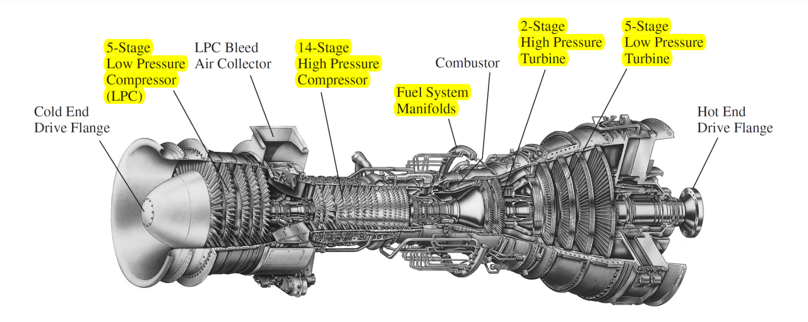

# TurbineNOxAnalyzer - Surveillance Évolutive des Émissions de NOx dans les Turbines à Gaz

## Janvier 2024 - Mars 2024

**Objectif :** Développement d'une solution complète pour évaluer et suivre la production de NOx au fil du temps dans une turbine à gaz. La solution utilise des capteurs pour mesurer divers paramètres environnementaux, un modèle de régression ExtraTreesRegressor pour prédire les niveaux de NOx, et une interface web pour visualiser les résultats en temps réel.

## Architecture du Projet

## Technologies Utilisées
- **Flask**: Framework web en Python pour la création de l'interface utilisateur dynamique.
- **Kafka**: Plateforme de diffusion de flux en temps réel pour la gestion des données provenant des capteurs.
- **Python**: Langage de programmation principal pour le développement, y compris l'implémentation du modèle de régression extrarandomregresor.
- **Spark**: Traitement des données en temps réel avec Apache Spark pour la prédiction des niveaux de NOx.
- **PostgreSQL**: Système de gestion de base de données relationnelle pour stocker les résultats prédits et les valeurs actuelles de NOx.
- **SocketIO**: Bibliothèque pour la communication bidirectionnelle en temps réel entre le serveur Flask et le client web.
- **GitHub**: Plateforme de gestion de version pour le suivi des modifications et la collaboration.

## Fonctionnalités Principales

### 1. Acquisition de Données avec les Capteurs
- Utilisation de capteurs pour mesurer des paramètres tels que la température ambiante, la pression, l'humidité, etc.
- Émission des données par le capteur vers l'API.

### 2. Stockage des Données en Temps Réel avec Kafka
- Utilisation de Kafka pour stocker les données provenant des capteurs en temps réel.
- Transmission fluide des données vers le système de traitement Spark.

### 3. Jobs Spark pour Prédire les Niveaux de NOx
- Implémentation de jobs Spark pour traiter les données en temps réel à partir de Kafka.
- Utilisation du modèle de régression [`ExtraTreesRegressor`](https://scikit-learn.org/stable/modules/generated/sklearn.ensemble.ExtraTreesRegressor.html) de scikit-learn pour prédire les niveaux de NOx.
- Stockage des résultats dans une base de données PostgreSQL.

### 4. Interface Web pour la Visualisation
- Construction d'une interface web avec Flask et SocketIO.
- Affichage en temps réel des valeurs actuelles et prédites de NOx.
- Graphiques et tableaux dynamiques pour suivre l'évolution des niveaux de NOx au fil du temps.

## Comment Utiliser le Projet

1. **Installation:**
   - Cloner le référentiel depuis GitHub.
   - Configurer l'environnement virtuel Python.
   - Installer les dépendances avec `pip install -r requirements.txt`.

2. **Configuration:**
   - Configurer les capteurs et l'API pour l'émission des données.
   - Définir les paramètres de Kafka dans le fichier de configuration.
   - Configurer la base de données PostgreSQL.

3. **Démarrage:**
   - Lancer les capteurs pour collecter les données.
   - Démarrer l'API pour rendre les données disponibles.
   - Exécuter le job Spark pour traiter les données et prédire les niveaux de NOx.
   - Lancer l'interface web avec Flask.

4. **Utilisation:**
   - Accéder à l'interface web dans le navigateur.
   - Visualiser les valeurs actuelles et prédites de NOx.
   - Observer les graphiques pour suivre l'évolution des niveaux de NOx au fil du temps.

5. **Contributions:**
   - Les contributions sont les bienvenues. Veuillez consulter les directives de contribution dans le fichier CONTRIBUTING.md.

6. **Licence:**
   - Ce projet est sous licence [MIT](LICENSE.md).

7. **Remerciements:**
   - Merci à tous les contributeurs et aux sources de données qui ont rendu ce projet possible.

8. **Contact:**
   - Pour toute question ou problème, veuillez contacter [votre nom et votre adresse e-mail].
